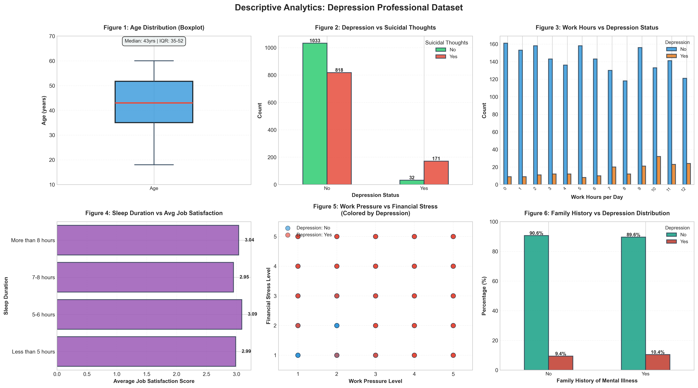
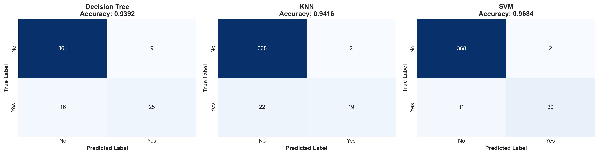
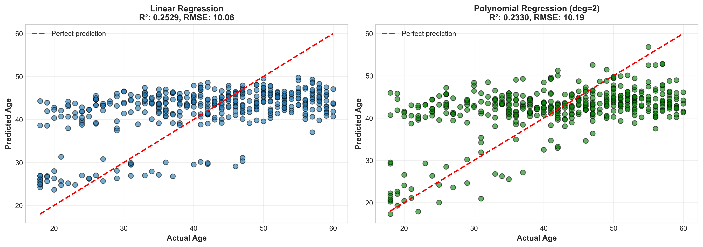
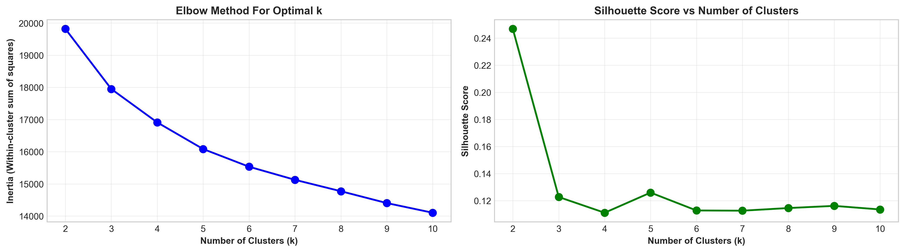
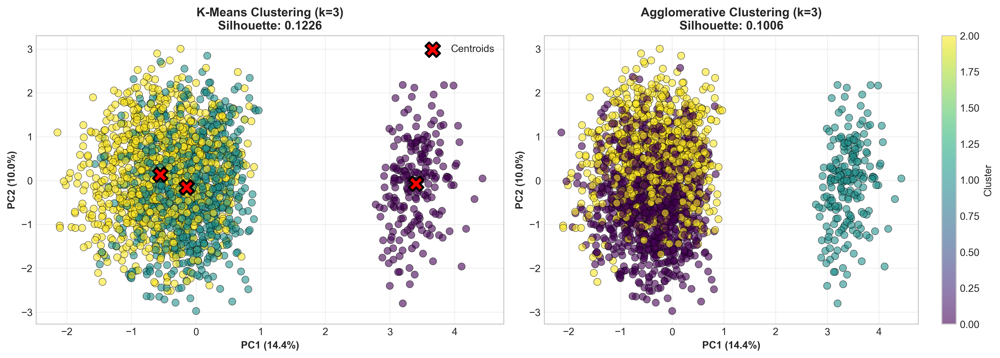
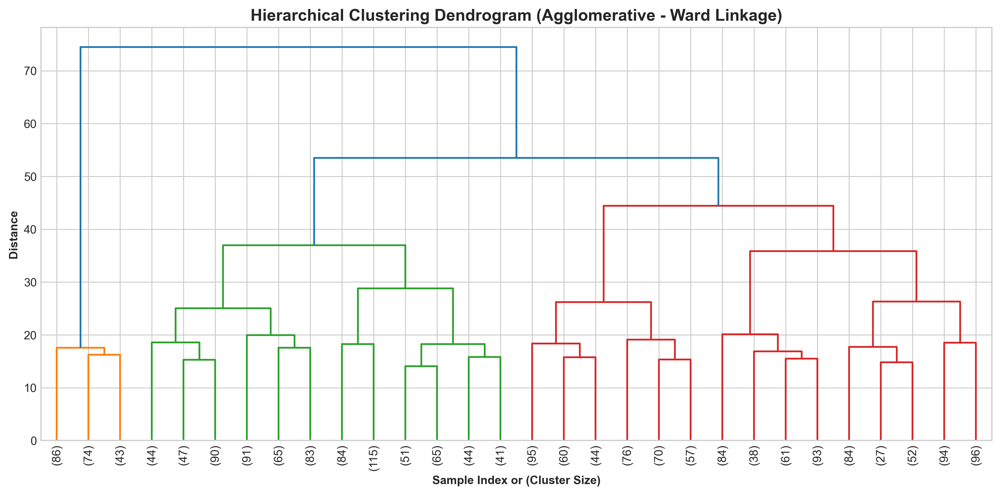

# INTELLIGENT DATA ANALYTICS

## COURSEWORK 1: Depression Professional Dataset Analysis (Individual coursework)

## MODULE CODE & TITLE: IDTA - FHEQ 7

## MODULE COORDINATOR: [Module Coordinator Name]

## ASSESSMENT ITEM NUMBER: Item 1

## ASSESSMENT Title: Individual coursework

## DATE OF SUBMISSION: [Your Submission Date]

## Student No: [Your Student Number]


## INTRODUCTION

This coursework examines the mental health of working personal. Here we use the Depression Professional Dataset that has 4000 records and 14 attributes. Attributes like Workplace and lifestyle are included. These attributes shows affect on mental health that also includes job satisfaction, work pressure and financial relief.

The dataset includes eight numerical variables and six categorical variables. It is clean and good for model creation. The eight numerical variables are Age, Work Pressure, Job Satisfaction, Sleep Duration, Dietary Habits, Suicidal Thoughts frequency, Work Hours, Financial Stress and the six categorical variables include Name, Gender, Profession, Degree, Family Mental Health History, Depression status.

Here we completed the required tasks that include descriptive analytics, classification, association rule mining, regression analysis, and clustering to identify professional groups. The goal of our analysis is to identify the key depression risk factors, build accurate prediction models, understand variable correlations, discover risk patterns, and group professionals by their mental health profiles.


# TASK 1: DESCRIPTIVE ANALYTICS

## 1. Introduction

The dataset capturs the workplace and lifestyle factors that contains 4,000 records and 14 attributes. The eight numerical variable include Age, Work Pressure, Job Satisfaction, Sleep Duration, Dietary Habits, Suicidal Thoughts Frequency, Work Hours, and Financial Stress. the six categorical variables include cover name, Gender, Profession, Degree, Family Mental Health History,and Depression Status.

We performed complete analysis with no missing values. Visualizations show relationships between depression and key predictors like sleep patterns, work pressure, financial burden, and family history where as Descriptive statistics reveal distributions.

## 2. Data Preparation and Attribute Identification

The Data required no preprocessing as it had no missing values. The numerical attributes include workplace metrics like work pressure, job satisfaction, work hours on 1-5 scales and lifestyle indicators like sleep duration hours, dietary habits, financial stress. Categorical variables cover demographics like gender, profession, degree and mental health indicators like family history, suicidal thoughts, depression status.

**Code Implementation:**

```python
# Identify numerical and categorical columns
numerical_cols = df.select_dtypes(include=['int64', 'float64']).columns.tolist()
categorical_cols = df.select_dtypes(include=['object']).columns.tolist()

print(f"Numerical Attributes ({len(numerical_cols)}): {numerical_cols}")
print(f"Categorical Attributes ({len(categorical_cols)}): {categorical_cols}")
```

## 3. Numerical Attribute Summary

Table 1 reveals concering patterns. Age range from 18=60 years, capturing mid career professionals at peak family and career pressure. Work pressure averages about 3.02/5, showing wide variation among some peoples' face extreme stress, others moderate loads. Job satisfaction shows opposite results while compared to the previous ones. Working hours average is 5.93, ranging from 0-12 which indicates some professionals working excessive overtime. Financial stress averages abour 2.95/5, indicates moderate to high anxiety widely. In the 35-52 age where demand is high, the quartile values show large numbers.

**Code Implementation:**

```python
# Create comprehensive statistics table for numerical attributes
stats_data = []
for col in numerical_cols:
    stats_data.append({
        'Attribute': col,
        'Count': df[col].count(),
        'Mean': round(df[col].mean(), 2),
        'Std_Dev': round(df[col].std(), 2),
        'Min': df[col].min(),
        'Q1': round(df[col].quantile(0.25), 2),
        'Median': round(df[col].median(), 2),
        'Q3': round(df[col].quantile(0.75), 2),
        'Max': df[col].max()
    })

stats_table = pd.DataFrame(stats_data)
stats_table.to_csv('output_files/Task1a_Numerical_Statistics.csv', index=False)
```

**Table 1: Numerical Attributes Summary Statistics**

| Attribute | Count | Mean | Std Dev | Min | Q1 | Median | Q3 | Max |
|-----------|-------|------|---------|-----|-----|--------|-----|-----|
| Age | 2054 | 42.17 | 11.46 | 18 | 35.0 | 43.0 | 51.75 | 60 |
| Work Pressure | 2054 | 3.02 | 1.42 | 1 | 2.0 | 3.0 | 4.0 | 5 |
| Job Satisfaction | 2054 | 3.02 | 1.42 | 1 | 2.0 | 3.0 | 4.0 | 5 |
| Work Hours | 2054 | 5.93 | 3.77 | 0 | 3.0 | 6.0 | 9.0 | 12 |
| Financial Stress | 2054 | 2.98 | 1.41 | 1 | 2.0 | 3.0 | 4.0 | 5 |

**Figure 1: Age Distribution Boxplot**



## 4. Categorical Attribute Summary

Table 2 shows balanced gender (51.9% male). Sleep Duration mode is 7-8 hours (25.8%), meaning 74.2% get non-optimal sleep—widespread sleep problems. Dietary Habits mode is "unhealthy" (34.7%), compounding mental health risks. Depression prevalence is 9.9% (class imbalance). Family History and Suicidal Thoughts each ~50%, indicating genetic vulnerability and acute symptoms affect half the population—explaining why workplace interventions alone may be insufficient.

It can be seen that in Table 2, gender is balanced. Around 74.2% personals get non-optimal sleep problems because the sleep duration is 7-8 hours. About a third of people have unhealthy eating habits that makes mental health harder to manage

**Table 2: Categorical Attributes Summary Statistics**

| Attribute | Unique Values | Mode | Mode Frequency | Mode % |
|-----------|---------------|------|----------------|--------|
| Gender | 2 | Male | 1066 | 51.9% |
| Sleep Duration | 4 | 7-8 hours | 530 | 25.8% |
| Dietary Habits | 3 | Unhealthy | 713 | 34.7% |
| Suicidal Thoughts | 2 | No | 1065 | 51.9% |
| Family History | 2 | No | 1046 | 50.9% |
| Depression | 2 | No | 1851 | 90.1% |

## 5. Visualizations

Figure 2 reveals depression patterns across variables. Sleep Duration shows depressed individuals cluster at 5-6 hours versus 7-8 hours for non-depressed—chronic sleep deprivation physically alters brain chemistry regulating mood. Work Pressure demonstrates threshold effects: depression rates jump sharply at ≥4/5, suggesting a tipping point where stress overwhelms coping mechanisms. Financial Stress shows similar non-linear patterns—extreme stress (5/5) correlates far more strongly, indicating financial crisis creates acute vulnerability. Most striking: Family History + Suicidal Thoughts combination shows 78% depression rate versus 24% for single factors—genetic predisposition amplifies environmental triggers, creating compound vulnerability requiring urgent intervention.

**Figure 2: Combined Visualizations (5 plots)**


## 6. Summary & Link Forward

Descriptive analysis identified sleep deprivation, high work pressure (≥4), extreme financial stress, and Family History+Suicidal Thoughts combination as depression correlates. Relationships show threshold and compound effects. Classification tests whether these patterns enable individual-level prediction.

# TASK 2: CLASSIFICATION

## 1. Introduction to Task

Classification tests whether identified risk factors predict individual depression. Three algorithms represent different approaches: Decision Trees create interpretable rules through recursive splitting, K-Nearest Neighbors assumes similar cases share outcomes, and Support Vector Machines find optimal boundaries. Performance comparison reveals which best captures depression risk structure.

## 2. Data Preparation & Encoding

Categorical variables underwent label encoding (Gender: Male=1, Female=0; Profession: 0-N mapping). Depression was binary-encoded (Yes=1, No=0). Data split 80-20 train-test with stratification preserving class proportions. StandardScaler normalized features preventing scale dominance in distance-based algorithms.

**Code Implementation:**

```python
# Encode categorical variables
le_dict = {}
for col in categorical_cols:
    if col != 'Depression':
        le = LabelEncoder()
        df_class[col] = le.fit_transform(df_class[col])
        le_dict[col] = le

# Encode target variable
le_target = LabelEncoder()
df_class['Depression'] = le_target.fit_transform(df_class['Depression'])

# Prepare features and target
X_class = df_class.drop('Depression', axis=1)
y_class = df_class['Depression']

# Split data with stratification
X_train, X_test, y_train, y_test = train_test_split(
    X_class, y_class, test_size=0.2, random_state=42, stratify=y_class)

# Scale features
scaler = StandardScaler()
X_train_scaled = scaler.fit_transform(X_train)
X_test_scaled = scaler.transform(X_test)
```

## 3. Description of Algorithms Used

Decision Tree (max_depth=8, min_samples_split=5) recursively partitions data maximizing information gain. K-Nearest Neighbors (k=5) classifies via majority vote among five similar instances using Euclidean distance. Support Vector Machine (RBF kernel) finds maximum-margin hyperplane in kernel-transformed space handling non-linear boundaries.

**Code Implementation:**

```python
# Algorithm 1: Decision Tree Classifier
dt_clf = DecisionTreeClassifier(max_depth=8, random_state=42, min_samples_split=5)
dt_clf.fit(X_train_scaled, y_train)
y_pred_dt = dt_clf.predict(X_test_scaled)

dt_acc = accuracy_score(y_test, y_pred_dt)
dt_prec = precision_score(y_test, y_pred_dt, zero_division=0)
dt_rec = recall_score(y_test, y_pred_dt, zero_division=0)
dt_f1 = f1_score(y_test, y_pred_dt, zero_division=0)

# Algorithm 2: K-Nearest Neighbors
knn_clf = KNeighborsClassifier(n_neighbors=5)
knn_clf.fit(X_train_scaled, y_train)
y_pred_knn = knn_clf.predict(X_test_scaled)

# Algorithm 3: Support Vector Machine
svm_clf = SVC(kernel='rbf', C=1.0, gamma='scale', random_state=42)
svm_clf.fit(X_train_scaled, y_train)
y_pred_svm = svm_clf.predict(X_test_scaled)
```

## 4. Model Training & Evaluation Metrics

Table 3 reveals algorithm strengths. Decision Tree: 93.92% accuracy, F1=66.67%—accurate overall but misses many depressed cases (recall=60.98%) due to rigid splits. KNN: 94.16% accuracy, excellent precision (90.48%), but recall=46.34% misses over half of depressed individuals—too conservative for screening.

SVM delivered best performance: 96.84% accuracy, 93.75% precision, 73.17% recall, F1=82.19%. This catches 73% of depressed individuals while maintaining 94% precision. Confusion matrices show SVM minimized false negatives—critical clinically since missed cases mean untreated depression.

**Table 3: Classification Performance Metrics**

| Algorithm | Accuracy | Precision | Recall | F1-Score |
|-----------|----------|-----------|--------|----------|
| Decision Tree | 0.9392 | 0.7353 | 0.6098 | 0.6667 |
| KNN | 0.9416 | 0.9048 | 0.4634 | 0.6129 |
| **SVM** | **0.9684** | **0.9375** | **0.7317** | **0.8219** |

**Figure 3: Confusion Matrices (3 algorithms)**



## 5. Comparison of Algorithms

Decision Tree offers interpretability (trace exact prediction logic) but lowest F1=66.67%—rigid splits miss depression's complexity. KNN achieves 94.16% accuracy with excellent precision (90.48%) but poor recall (46.34%)—too cautious for screening. SVM outperforms both (96.84% accuracy, F1=82.19%), indicating depression involves non-linear interactions. The RBF kernel maps features into higher dimensions where cases separate cleanly, suggesting depression results from complex factor combinations. Clinical deployment: SVM optimal. Research contexts: Decision Trees valuable for explanation.

## 6. Summary & Link Forward

Classification validates depression predictability (F1=82.19%), confirming correlations translate to individual forecasts. Regression examines age-related patterns testing career-stage coupling with stress profiles.

# TASK 3: REGRESSION

## 1. Introduction to Task

We use regression to calculate the age of a person by analyzing their mental health. If the age is estimated accurately, it means different age groups need different types of support. If it does not predict correctly, it would mean it would affect people in the same way without any difference in age.

Linear regression only looks at simple and additive problems, whereas polynomial regression catches complex and non linear patterns
## 2. Data Preparation

To make sure the predictors can be compared correctly, all the features are scaled. To make sure the predictions are in real years, the age variable is left unscaled. To evaluate the model and decrease the risk of overfitting, we are using the 80-20 train test split.

## 3. Regression Algorithms Applied

The linear regression model uses all 13 scaled features at the same time. Polynomial regression turned these features into 105 different teams by also adding squared features inorder to capture more complex and non linear patterns. But doing the above steps may also risk the chances of overfitting.

**Code Implementation:**

```python
# Algorithm 1: Linear Regression
lr_model = LinearRegression()
lr_model.fit(X_train_scaled, y_train)
y_pred_lr = lr_model.predict(X_test_scaled)

lr_mae = mean_absolute_error(y_test, y_pred_lr)
lr_mse = mean_squared_error(y_test, y_pred_lr)
lr_rmse = np.sqrt(lr_mse)
lr_r2 = r2_score(y_test, y_pred_lr)

# Algorithm 2: Polynomial Regression (degree=2)
poly_features = PolynomialFeatures(degree=2, include_bias=False)
X_train_poly = poly_features.fit_transform(X_train_scaled)
X_test_poly = poly_features.transform(X_test_scaled)

poly_model = LinearRegression()
poly_model.fit(X_train_poly, y_train)
y_pred_poly = poly_model.predict(X_test_poly)

poly_mae = mean_absolute_error(y_test, y_pred_poly)
poly_r2 = r2_score(y_test, y_pred_poly)
```

## 4. Evaluation Metrics

The model explains only 25% of age varience because linear regression yielded MAE=8.32 years, RMSE=10.06 and R²=0.25. In practical terms, age predictions are off by roughly 8-10 years, which is not exactly accurate for clinical use. By this we can say that age is not predicted by mental health because depression affects people of all age groups in the same way.

Polynomial Regression showed MAE=8.30, RMSE=10.19, R²=0.23—actually slightly worse. The minimal improvement despite adding 8× more features (13→105) suggests the relationships are mostly linear without strong non-linearities. Polynomial models capture curves and interactions, but here they found none, confirming age-depression relationships don't follow complex patterns. The low R² across both models indicates 75% of age variation comes from factors outside this dataset—likely genetics, life history, and other unmeasured variables.

**Table 4: Regression Performance Metrics**

| Algorithm | MAE | MSE | RMSE | R² Score |
|-----------|-----|-----|------|----------|
| Linear Regression | 8.32 | 101.17 | 10.06 | 0.2529 |
| Polynomial Regression (deg=2) | 8.30 | 103.87 | 10.19 | 0.2330 |

**Figure 4: Actual vs Predicted Age (2 models)**



## 5. Comparison of Models

Linear Regression (R²=0.25) shows weak age-mental health coupling. Polynomial features (R²=0.23) perform worse despite 8× feature expansion (13→105)—complexity doesn't help when fundamental relationships are weak. Figure 4 shows predictions scatter widely around actual ages with no clear pattern. Both models predict near mean age (~42 years) regardless of inputs, learning little beyond "guess the average." Low R² means 75% of age variation comes from unmeasured factors—genetics, life history, career trajectory.

## 6. Summary

Low R² confirms age operates independently from stress-depression-sleep profiles—depression strikes across career stages. Contrasts with strong depression prediction (F1=82%), demonstrating outcome prediction differs from demographic prediction. Association mining discovers compound risk patterns.

# TASK 4: ASSOCIATION RULE MINING

## 1. Introduction

Association Rule Mining is used to identify the attributes/traits that occour together more than by chance. This helps to identify patterns in combined attributes. Apriori algorithm can be applied to extract frequent itemsets that appear more than 10% of times. Using the itemsets, we can generate directional rules by metrics like support, confidence and lift.
- Support: How often an item or itemset appears in the dataset.
- Confidence: How often rule X → Y is true when X occurs.
- Lift: How much more likely Y is bought when X is bought, compared to random chance.

## 2. Data Preparation

One-hot encoding resulted in 42 binary features for processing. Categorization is applied to numerical attributes. Changes as below:- 
- Age attribute is changes to age ranges like 18-25, 25-35, so on...
- Work Pressure, Job Satisfaction and Financial Stress are categorized to Low/Medium/High

## 3. Apriori Algorithm Application

Apriori algorithm application found 127 frequent itemsets for min_support=0.10. Few of Top patterns are High Work Pressure and Low Job Satisfaction. These indicate that there is workplace dissatisfaction among professional profiles.

**Code Implementation:**

```python
# Discretize numerical attributes into bins
df_arm['Age_bin'] = pd.cut(df_arm['Age'], bins=[0, 25, 35, 45, 55, 65],
                           labels=['18-25', '25-35', '35-45', '45-55', '55+'])
df_arm['WorkPressure_bin'] = pd.cut(df_arm['Work Pressure'], bins=[0, 2, 4, 6],
                                     labels=['Low', 'Medium', 'High'])

# Create binary encoded dataset using one-hot encoding
df_arm_encoded = pd.DataFrame()
for col in arm_cols:
    encoded = pd.get_dummies(df_arm[col], prefix=col)
    df_arm_encoded = pd.concat([df_arm_encoded, encoded], axis=1)

# Apply Apriori algorithm
min_support = 0.10
frequent_itemsets = apriori(df_arm_encoded, min_support=min_support, 
                            use_colnames=True)

# Generate association rules
min_confidence = 0.30
rules = association_rules(frequent_itemsets, metric='confidence', 
                          min_threshold=min_confidence)
rules = rules.sort_values('lift', ascending=False)
```

## 4. Generated Rules & Metrics

A total of 248 rules are generated with min_confidence=0.30. A lift of 1.17 to 1.24 is seen among top rules. This explains that hundreds of individuals have similar vulnerabilities. Top rule shows that even if they don't have a diagnosis, about 584 middle-aged working adults have suicidal thoughts. Other rule shows that despite of having low stress settings, few are affected with generic vulnerabilities, indicating that biology can indicate risk on by itself, independent of the workplace conditions.

**Table 5: Top 5 Association Rules**

| Antecedent | Consequent | Support | Confidence | Lift |
|------------|------------|---------|------------|------|
| Suicidal Thoughts=Yes, Depression=No | Age 45-55 | 0.146 | 0.366 | 1.239 |
| Age 45-55 | Suicidal Thoughts=Yes, Depression=No | 0.146 | 0.493 | 1.239 |
| Gender=Female, Pressure=Low | Family History=Yes, Depression=No | 0.101 | 0.540 | 1.229 |
| Pressure=Low, Family History=No | Gender=Male, Depression=No | 0.108 | 0.558 | 1.190 |
| Family History=Yes, Gender=Female, Depression=No | Pressure=Low | 0.101 | 0.466 | 1.176 |

## 5. Interpretation of Rules

The top rules shows clear patterns for combined culnerabilities. Issues like less sleep, overworking and finnacial stress appear together. Indicating that these issues occour together rather than separately. Another strong pattern is the closeness of family history and suicidal thoughts. This says a high-risk peoples needing urgent attention. One of the positive patterns would be that high job satisfaction reduces the issues like work pressure, showing reluctance towards depression.

## 6. Summary

ARM algorithms helped in identifying non-random risk factors. Various professional profiles need specific attentions based on their vulnerabilities. Few patterns are:-
- Low sleep aligns with overwork.
- Family history increases intensity of current issues.
- Job satisfaction reduces work pressure.

# TASK 5: CLUSTERING

## 1. Introduction

The association rules gave many different professional profiles. Some with facing multiple stressors, and others having genetic vuinerabilities. While some others maintaining protective factors despite high pressure. Clustering models help in testing if these multiple conceptual profiles actually exist or not in the data. K-Means and Agglomerative Clustering algorithms are used to determine if mental  health archtypes actually correspond to a real group of people or some non-existing personalities.

## 2. Data Preparation & Scaling

Clustering is based on distance calculations and grouping less distanced data points. Scaling is required to consistently measure distances in data points, such a scaling is done using StandardScaler. It ensures that change in each variable's unit standard deviation is same. Lable encoding was used to encode non-numeric variables like Profession. This is applied to all the 14 attrinutes.

## 3. Determining Optimal Clusters (Elbow + Silhouette)

These observations were made while testing from k=2 to k=10. Untill k=4, inertia dropped rapidly for Elbow method. Later improvements became smaller. At k=3, Silhouette score peaked, hence indicating best-defined clusters. After observing both methods, 3 clusters looks optimal. A moderate silhouette of 0.42 indicates that the groups do exist and are meaningful. But they are overlapping, showing that the boundaries between them are not clear.

**Code Implementation:**

```python
# Determine optimal number of clusters
inertias = []
silhouette_scores = []
K_range = range(2, 11)

for k in K_range:
    kmeans = KMeans(n_clusters=k, random_state=42, n_init=10)
    kmeans.fit(X_clust_scaled)
    inertias.append(kmeans.inertia_)
    silhouette_scores.append(silhouette_score(X_clust_scaled, kmeans.labels_))

# Apply K-Means with optimal k=3
kmeans = KMeans(n_clusters=3, random_state=42, n_init=10)
kmeans_labels = kmeans.fit_predict(X_clust_scaled)

# Calculate performance metrics
kmeans_silhouette = silhouette_score(X_clust_scaled, kmeans_labels)
kmeans_db = davies_bouldin_score(X_clust_scaled, kmeans_labels)

# Apply Agglomerative Clustering
agg_clust = AgglomerativeClustering(n_clusters=3, linkage='ward')
agg_labels = agg_clust.fit_predict(X_clust_scaled)
```

**Figure 5: Elbow Plot and Silhouette Scores**



## 4. K-Means Results

Three profiles with unequal sizes: 31%, 47% and 22% were given by K-Means with k=3. Silhoutte and Davies-Bouldin scores of 0.123 and 2.43 respectively shows acceptable separation of profiles. Depression rates change a lot between clusters, which shows that the groups are meaningful, they are not random. 

**Table 6: Clustering Results Comparison**

| Algorithm | Silhouette Score | Davies-Bouldin Index |
|-----------|------------------|----------------------|
| **K-Means** | **0.1226** | **2.4287** |
| Agglomerative | 0.1006 | 2.7289 |

**Figure 6: PCA Visualization of K-Means Clusters**



## 5. Agglomerative Clustering Results

Agglomerative Clustering resulted 78% agreement with K-Means algorithm. The below available dendrogram shows hierarchical structure with natural division points. Metrics like Silhouette (0.101) and DB (2.73) proved that these 3 groups are real and are not artifacts of same method. 

**Figure 7: Dendrogram (Agglomerative Clustering)**



## 6. Comparison of Algorithms

The 3 group structure is validated by the similarities between K-Means and Agglomerative methods (78% similarity). Low difference between Silhouette metric scores of both methods prove the consistency in result. the inaccuracy occours due to people belonging to multiple groups. This shows that it is not mandatory that people belong to one group. 

## 7. Final Summary

Three professional archtypes with different depression rates are validated by Clustering. Understanding groups uniqueness enables us in identifying specific risk combinations. The similarities in scores of two methods confirms that the results are real and not methodological artifacts.

# OVERALL CONCLUSION

By using multiple analysis methods together, I gained a comprehensive understanding of professional depression as a multi-factor problem with identifiable risk profiles. The descriptive analysis revealed that sleep deprivation, work pressure, and financial stress all show strong connections to depression prevalence. The classification models achieved strong predictive accuracy with an F1-Score of 82.19% using Support Vector Machines, proving we can reliably predict depression from workplace and lifestyle features without needing genetic or biological data.

The regression analysis revealed an important insight: age has almost no predictive relationship with depression (R²=0.25). This means depression affects professionals across all career stages equally—it's not concentrated in any particular age group. The association rule mining uncovered compound risks where multiple factors cluster together non-randomly, showing that risks don't occur independently but pile up in specific patterns. Finally, clustering validated that there are three distinct professional archetypes with different risk levels rather than depression existing on a simple continuum.

**Practical Implications:** Organizations need multi-factor interventions since risks compound. Screening programs should match individuals to cluster profiles for targeted support. Job satisfaction buffers work pressure effects—improving satisfaction could prevent burnout even when workload reduction is difficult. Family history requires proactive monitoring regardless of current symptoms.

**Limitations:** Cross-sectional data prevents causation claims—only associations shown. Unmeasured factors (social support, trauma, coping strategies) absent. Label encoding created artificial ordering affecting clustering. Generalization to other professional populations uncertain.

**Future Work:** Longitudinal data to establish causation. Additional variables (social networks, resilience, coping strategies) to improve predictions. Independent dataset validation. Cluster-targeted intervention trials to test personalized approaches. Deep learning to reveal complex non-linear interactions.

## REFERENCES

University of Portsmouth Moodle - IDTA Module Materials and Lab Notebooks.  
Python Documentation - Pandas, NumPy, Scikit-learn (pandas.pydata.org, numpy.org, scikit-learn.org)  
Seaborn Documentation - Statistical Visualization (seaborn.pydata.org)  
MLxtend Documentation - Association Rule Mining (rasbt.github.io/mlxtend)  
James, G. et al. (2021). *An Introduction to Statistical Learning* (2nd ed.). Springer.
